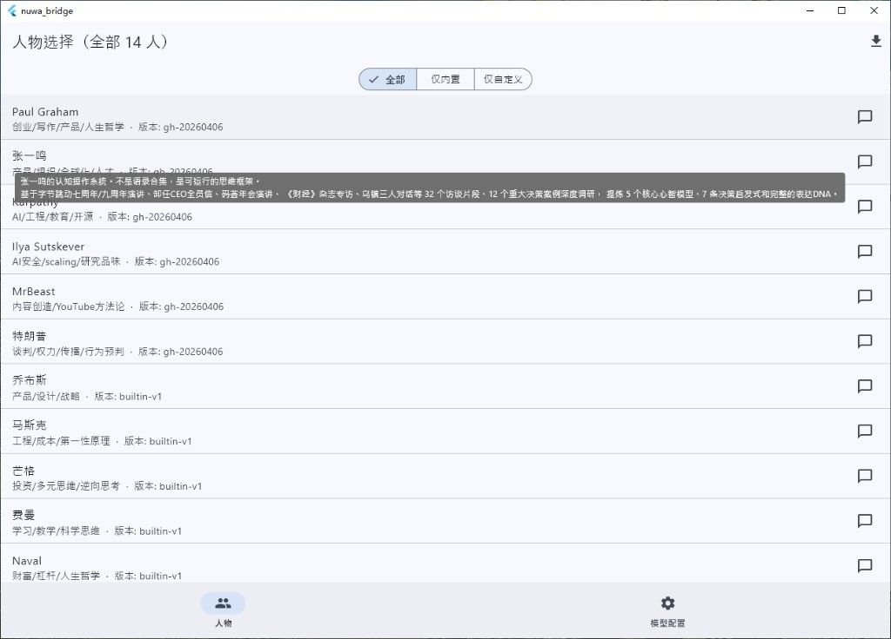
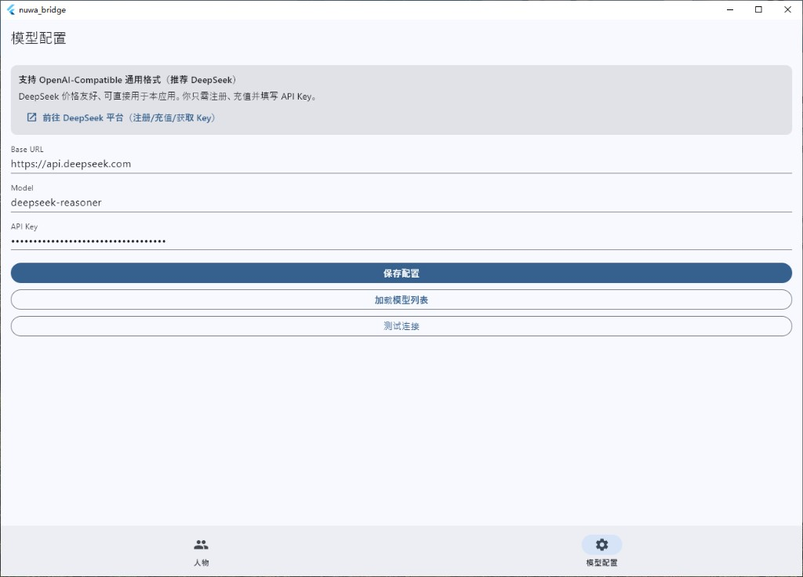
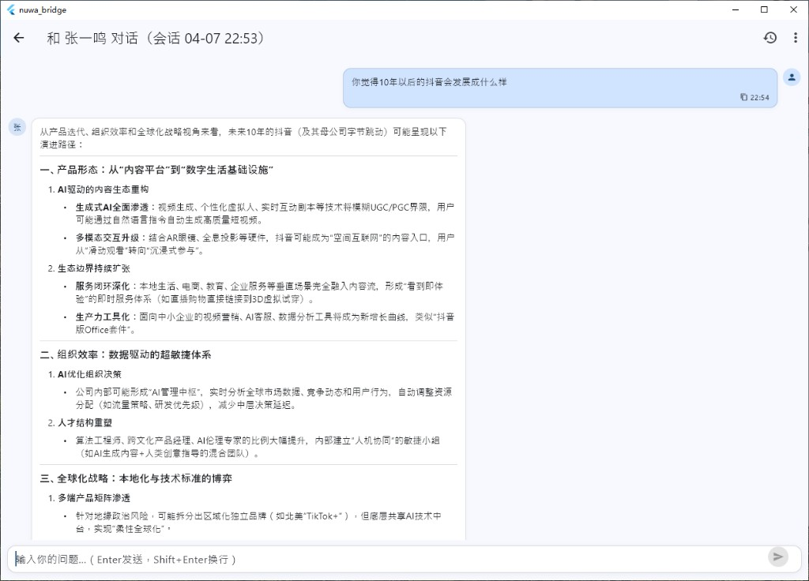
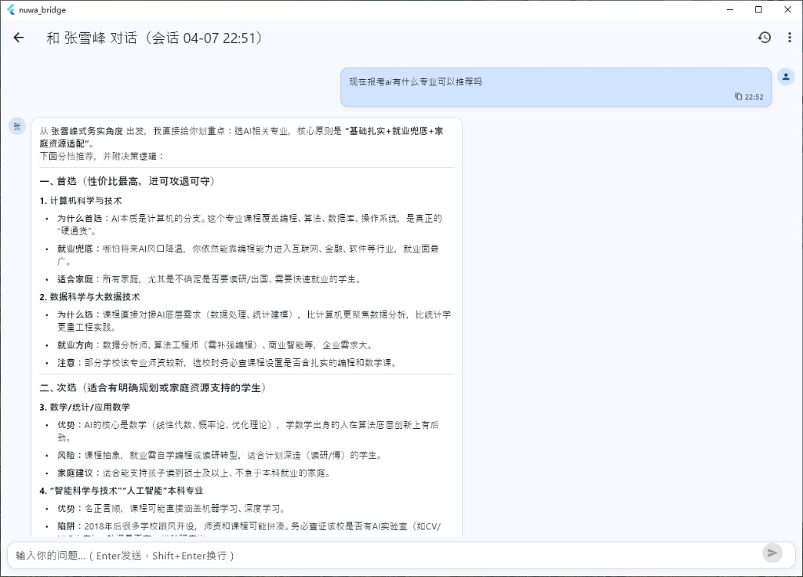

# Nuwa Bridge

Nuwa Bridge 是一个支持 Windows + Android 的多角色 AI 对话客户端。  
你可以直接选择内置人物/主题 Skill 进行对话，也可以导入外部 Skill（GitHub 仓库或 SKILL.md 链接），并使用 OpenAI-Compatible 接口接入各类大模型服务。

## 项目定位

- **跨端**：Flutter 单代码，支持 Windows 与 Android。
- **低门槛**：默认推荐 DeepSeek，填好 `baseUrl`、`model`、`apiKey` 即可使用。
- **角色化对话**：内置多位蒸馏人物与主题 Skill，支持会话管理、导出备份、流式回复。
- **可开源二次开发**：清晰的模型配置、人物管理、会话管理结构，便于扩展。

## 功能特性

- 人物库：内置 14 个角色/主题（含 X 导师）
- 人物筛选：全部 / 仅内置 / 仅自定义
- 人物信息：长按查看来源、版本、简介；悬停名字显示简介 Tooltip
- 模型配置：支持 OpenAI-Compatible，内置 DeepSeek 默认配置
- 连接诊断：加载模型列表 + 测试连接
- 对话体验：回车发送、Shift+Enter 换行、流式输出、Markdown 渲染
- 会话能力：新建会话、切换会话、清空当前会话、JSON 导出备份

  <br />

## 界面预览

### 1) 人物列表与筛选



### 2) 模型配置（默认 DeepSeek）



### 3) 角色对话示例（张一鸣）



### 4) 角色对话示例（张雪峰）



## 快速开始

### 运行环境

- Flutter 3.41+
- Windows 10/11（桌面打包）
- Android SDK（APK 打包）

### 本地运行

```bash
flutter pub get
flutter run -d windows
```

## 打包说明

### Windows EXE

```bash
flutter build windows --release
```

产物路径：

`build/windows/x64/runner/Release/nuwa_bridge.exe`

### Android APK

```bash
flutter build apk --release
```

产物路径：

`build/app/outputs/flutter-apk/app-release.apk`

## 使用说明书

完整使用说明见：

- [使用说明书](docs/USAGE.md)

## 目录结构（核心）

```text
lib/main.dart                 # 主应用逻辑（页面、模型、人物、会话）
docs/USAGE.md                 # 使用说明书
docs/images/                  # README 配图
```

## 开源鸣谢

本项目灵感来源于：

- [alchaincyf/nuwa-skill](https://github.com/alchaincyf/nuwa-skill)

感谢该项目开源了高质量的 Skill 思路与方法论，让“可运行的人物/领域认知框架”产品化成为可能。

## 免责声明

- 本项目用于学习、研究和效率提升，不构成任何投资、医疗、法律等专业建议。
- 角色化回答基于公开资料抽象，不代表真实人物观点。

***

## 关注公众号

如果这个项目对你有帮助，欢迎扫码关注公众号获取更新：


